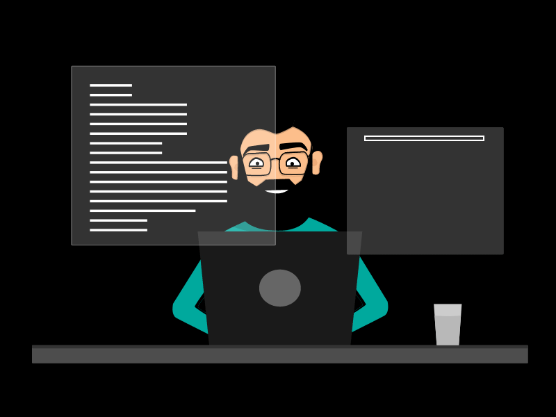
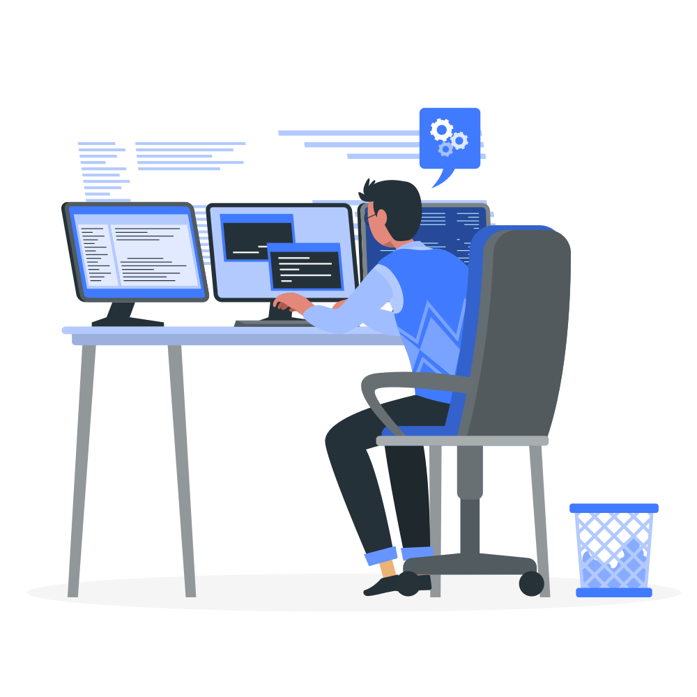

<div align="center">


# 👨🏻‍💻 Chandra Prakash Singh

### MERN Full-Stack Developer • SaaS Builder • REST API Developer



</div>

---

## 👨🏻‍💻 About Me

- 👋 Hi, I'm **Chandra Prakash Singh**.
- 💻 I'm a **MERN Full-Stack Developer**.
- 🚀 I build **modern, responsive and production-ready web applications**.
- ⚛️ I work with **React.js, JavaScript, Node.js, Express.js and MongoDB**.
- 🧩 I enjoy building scalable **full-stack applications and REST APIs**.
- 🏗️ Currently working on real-world software products and SaaS projects.
- 🌐 Portfolio: [**www.chandradev.in**](https://www.chandradev.in/)
- 🏢 Building software solutions under **CodeCPS Technologies**.
- 🔐 Interested in **Authentication, Authorization, APIs, Security and scalable architectures**.
- 📚 Continuously learning new technologies and improving my development skills.
- ⚡ I love turning ideas into functional and useful digital products.
- 💬 Ask me about **MERN Stack, React, Node.js, Express.js, MongoDB and Web Development**.

---

## 🚀 What I Do

```text
💻 Full-Stack Web Development
⚛️ React.js Application Development
🟢 Node.js & Express.js Backend Development
🍃 MongoDB Database Design
🔐 Authentication & Authorization
🌐 REST API Development
📦 Scalable Project Architecture
🎨 Responsive UI Development
⚡ Performance Optimization
🚀 Deployment & Production Setup
```

---

## 🛠️ Technologies & Tools

### 💻 Languages

### ⚛️ Frontend

### 🟢 Backend

### 🍃 Database

### 🔐 Development & Tools

---

## 🧰 My Development Approach

```text
Idea
  ↓
Planning & Architecture
  ↓
Frontend Development
  ↓
Backend & REST APIs
  ↓
Database Integration
  ↓
Authentication & Security
  ↓
Testing & Optimization
  ↓
Deployment
  ↓
Production 🚀
```

---

## 🚀 Featured Projects

### 🛒 Premium E-commerce Platform

A scalable full-stack e-commerce platform designed with a production-oriented architecture.

**Core Areas:**

- 👤 Customer Authentication
- 🏪 Seller Management
- 👨‍💼 Admin Management
- 📦 Products & Categories
- 🏷️ Brands & Product Variants
- 📊 Inventory Management
- 🛒 Cart & Wishlist
- 💳 Checkout & Payments
- 📦 Orders & Order Tracking
- ⭐ Reviews
- 🎟️ Coupons
- 🔔 Notifications
- 📈 Admin Analytics

**Stack:** React.js • Node.js • Express.js • MongoDB • Tailwind CSS

---

### 🧰 CodeCPS Tools

An **All-in-One Online Tools SaaS Platform** for everyday digital, developer, file, image, PDF, SEO, productivity and utility tools.

**Planned Platform Capabilities:**

- 🖼️ Image Tools
- 📄 PDF Tools
- 👨‍💻 Developer Tools
- 🔤 Text Tools
- 🔐 Security & Generators
- 🌐 SEO & Web Tools
- 🧮 Calculators
- 🔄 Converters
- 🤖 Future AI Tools
- 💳 Free & Premium Plans
- 👤 User Dashboard
- 🔑 API Access
- 📊 Usage Tracking
- 🛠️ Admin Dashboard

**Stack:** MERN • React • Vite • Tailwind CSS • Node.js • Express.js • MongoDB

---

## 📊 GitHub Stats

---

## 📈 Contribution Activity

---

## 🏆 GitHub Trophies

---

## 🌐 Connect With Me

<div align="center">


&nbsp;&nbsp;&nbsp;


</div>

---

## 💡 Current Focus

```text
⚛️ Advanced React.js
🟢 Node.js & Express.js
🍃 MongoDB & Database Architecture
🔐 Web Security
🌐 REST API Design
🏗️ Scalable MERN Architecture
💳 SaaS & Subscription Systems
☁️ Production Deployment
🚀 Building Real-World Products
```

---

## ✨ Developer Philosophy

> "Build useful things. Keep learning. Write clean code.
> Turn ideas into products."

<div align="center">

### 🚀 Keep Building • Keep Learning • Keep Shipping

</div>
